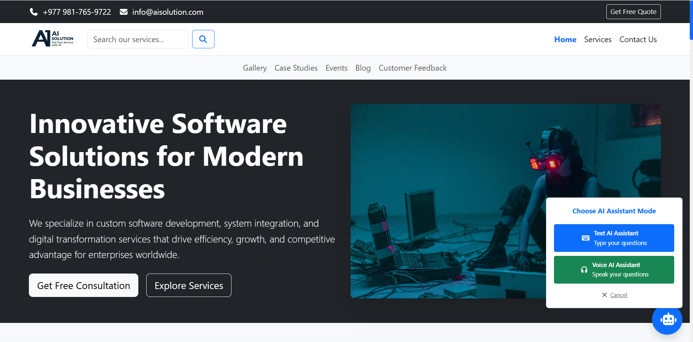
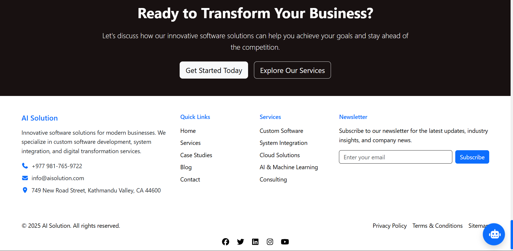
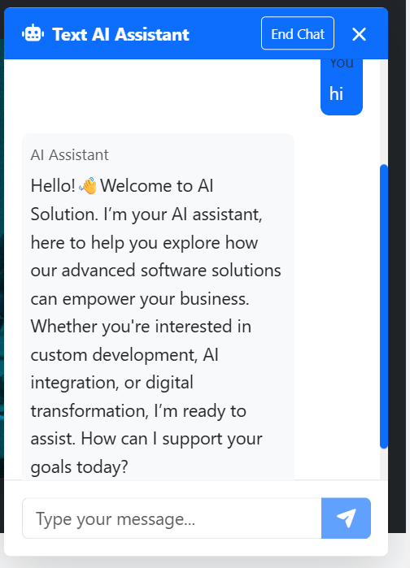
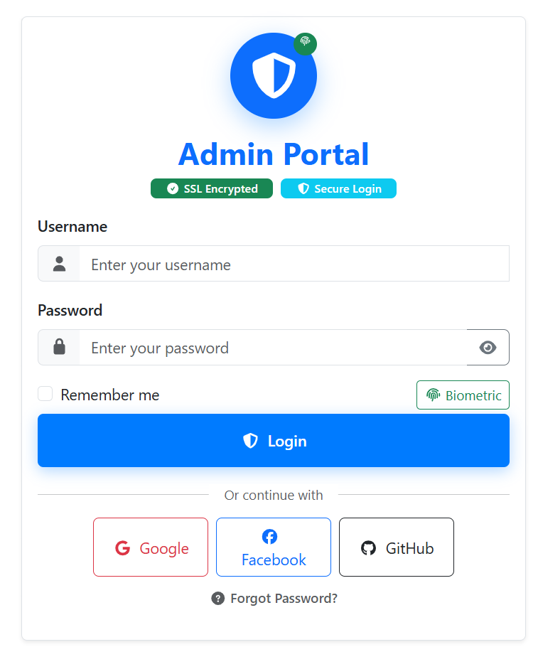
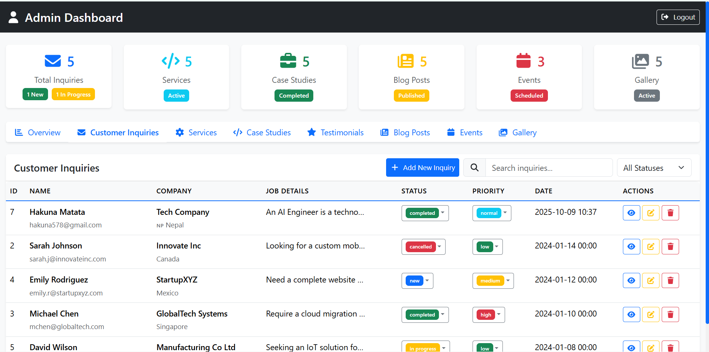
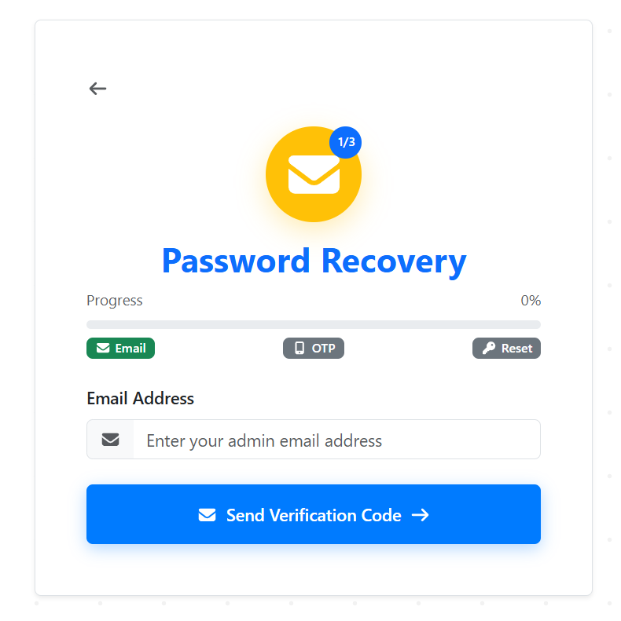

# 🤖 AI Solution Website
<a name="top"></a>

A comprehensive, modern full-stack website for an AI Solution company built with React, Express, PostgreSQL, and modern web technologies. Features include an AI-powered chatbot, admin dashboard, contact management, and responsive design.

## few Screenshots







## 🚀 Features

### ✨ Key Features

- **🤖 AI-Powered Chatbot**: Interactive customer support predefined response
- **📱 Fully Responsive**: Mobile-first design with Bootstrap 5
- **🎨 Modern UI/UX**: Clean, professional design with smooth animations
- **📝 Contact Management**: Comprehensive inquiry form with validation
- **🔐 Admin Dashboard**: Secure area for managing customer inquiries, content, and analytics
- **🔒 Password Security**: User passwords hashed using **Argon2id** for maximum security  
- **📊 Content Management**: Dynamic management of services, blog posts, case studies, and events
- **🖼️ Media Gallery**: Categorized photo gallery with filtering
- **📧 Email Integration**: Automated email notifications and password reset
- **🔍 Advanced Search**: Search and filtering across all content types
- **📈 Analytics**: Built-in statistics and reporting for admin users

### Pages & Sections

1. **Homepage**: Hero section, services overview, case studies, testimonials, blog preview, events
2. **Services**: Detailed service offerings with features and benefits
3. **Case Studies**: Success stories and project portfolios
4. **Feedback**: Customer testimonials and ratings
5. **Blog**: Articles and insights with category filtering
6. **Gallery**: Photo gallery with category filtering
7. **Events**: Upcoming and past events management
8. **Contact**: Contact form and company information
9. **Admin**: Login and dashboard for managing inquiries

### 🛠️ Technical Features

- **⚛️ React Architecture**: Component-based architecture with hooks
- **🛣️ Client-side Routing**: React Router DOM for seamless navigation
- **📊 State Management**: React Context API for global state
- **✅ Form Validation**: Comprehensive client-side validation
- **🔐 Authentication**: JWT-based admin authentication with Argon2 hashing
- **📤 File Upload**: Multer integration for image and document uploads
- **📧 Email Service**: Nodemailer for notifications and password reset
- **🗄️ Database**: PostgreSQL with optimized queries and indexing
- **🔍 Advanced Filtering**: Search and filter across all data types
- **📊 Data Export**: CSV export functionality for admin reports
- **🎨 UI Components**: Bootstrap 5 with custom styling and animations
- **📱 PWA Ready**: Progressive Web App capabilities

## 🛠️ Technology Stack

### Frontend

- **React**: 19.1.1
- **Styling**: Bootstrap 5, Custom CSS
- **Icons**: FontAwesome
- **Routing**: React Router DOM 7.8.2
- **Build Tool**: Vite 7.1.2
- **Package Manager**: npm

### Backend

- **Node.js**: Express 5.1.0
- **Database**: PostgreSQL
- **Authentication**: JWT, Argon2
- **File Upload**: Multer
- **Email**: Nodemailer
- **AI Integration**: OpenAI API
- **CORS**: Enabled for cross-origin requests

## 📁 Project Structure

```
ai-solution-website/
├── 📁 src/                            # Frontend React application
│   ├── 📁 components/                 # Reusable UI components
│   │   ├── 📄 Header.jsx              # Navigation and header
│   │   ├── 📄 Footer.jsx              # Footer with links and info
│   │   └── 📄 Chatbot.jsx             # AI chatbot widget
│   ├── 📁 pages/                      # Page components
│   │   ├── 📄 Home.jsx                # Homepage
│   │   ├── 📄 Services.jsx            # Services page
│   │   ├── 📄 CaseStudies.jsx         # Case studies
│   │   ├── 📄 Feedback.jsx            # Testimonials
│   │   ├── 📄 Blog.jsx                # Blog articles
│   │   ├── 📄 Gallery.jsx             # Photo gallery
│   │   ├── 📄 Events.jsx              # Events management
│   │   ├── 📄 Contact.jsx             # Contact form
│   │   ├── 📄 AdminLogin.jsx          # Admin authentication
│   │   ├── 📄 AdminDashboard.jsx      # Admin dashboard
│   │   └── 📄 NotFound.jsx            # 404 error page
│   ├── 📁 data/                       # Static data files
│   │   ├── 📄 services.js             # Services information
│   │   ├── 📄 caseStudies.js          # Case study data
│   │   ├── 📄 testimonials.js         # Customer feedback
│   │   ├── 📄 blog.js                 # Blog posts
│   │   ├── 📄 events.js               # Events data
│   │   ├── 📄 gallery.js              # Gallery images
│   │   └── 📄 inquiries.js            # Sample inquiry data
│   ├── 📁 contexts/                   # React contexts
│   │   └── 📄 AdminContext.jsx        # Admin authentication context
│   ├── 📁 utils/                      # Utility functions
│   │   └── 📄 securityUtils.js        # Security utilities
│   ├── 📁 image/                      # Static images
│   ├── 📁 media/                      # Media assets (logos, etc.)
│   ├── 📄 App.jsx                     # Main app component
│   ├── 📄 main.jsx                    # App entry point
│   ├── 📄 App.css                     # Custom styles
│   └── 📄 index.css                   # Global styles
├── 📁 server/                         # Backend Node.js/Express server
│   ├── 📁 routes/                     # API route handlers
│   │   ├── 📄 authRoutes.js           # Authentication routes
│   │   ├── 📄 inquiryRoutes.js        # Contact inquiry routes
│   │   ├── 📄 servicesRoutes.js       # Services management routes
│   │   ├── 📄 caseStudiesRoutes.js    # Case studies routes
│   │   ├── 📄 testimonialsRoutes.js   # Testimonials routes
│   │   ├── 📄 blogRoutes.js           # Blog management routes
│   │   ├── 📄 eventsRoutes.js         # Events management routes
│   │   ├── 📄 galleryRoutes.js        # Gallery management routes
│   │   ├── 📄 uploadRoutes.js         # File upload routes
│   │   └── 📄 chatbotRoutes.js        # AI chatbot routes
│   ├── 📄 db.js                       # Database connection
│   ├── 📄 db.sql                      # Database schema
│   ├── 📄 .env                        # Environment variables
│   ├── 📄 index.js                    # Server entry point
│   └── 📄 package.json                # Server dependencies
├── 📁 public/                         # Static assets
│   ├── 📁 uploads/                    # Uploaded files
│   └── 📄 vite.svg                    # Vite logo
├── 📄 index.html                      # Main HTML file
├── 📄 package.json                    # Frontend dependencies
├── 📄 vite.config.js                  # Vite configuration
├── 📄 eslint.config.js                # ESLint configuration
└── 📄 README.md                       # Project documentation

```

## 📱 Website Features

### Homepage

- **Hero Section**: Compelling headline with call-to-action buttons
- **Statistics**: Company achievements and metrics
- **About Section**: Company overview and mission
- **Services Preview**: Featured services with descriptions
- **Case Studies**: Success stories showcase
- **Testimonials**: Customer feedback carousel
- **Blog Preview**: Latest articles
- **Events**: Upcoming events
- **Call-to-Action**: Final conversion section

### Services Page

- **Service Grid**: Comprehensive service offerings
- **Feature Lists**: Detailed features and benefits
- **Interactive Modals**: Service detail popups
- **Why Choose Us**: Company advantages

### Contact Form

- **Required Fields**: Name, email, phone, company, country, job title, job details
- **Validation**: Client-side form validation
- **Success Messages**: User feedback on submission
- **Contact Information**: Company details and location

### Admin System

- **Login**: Username/password authentication
- **Dashboard**: Customer inquiries management
- **Search & Filter**: Advanced filtering capabilities
- **Export**: CSV export functionality
- **Statistics**: Overview metrics

### AI Chatbot

- **Interactive Widget**: Bottom-right corner placement
- **Smart Responses**: Context-aware replies
- **Quick Help**: Common questions and answers
- **User-Friendly**: Easy to use interface

## 🎨 Design Features

### Visual Elements

- **Modern Typography**: Clean, readable fonts
- **Color Scheme**: Professional blue-based palette
- **Icons**: FontAwesome icons throughout
- **Animations**: Smooth hover effects and transitions
- **Shadows**: Subtle depth and elevation

### Responsive Design

- **Mobile First**: Optimized for mobile devices
- **Breakpoints**: Responsive grid system
- **Touch Friendly**: Mobile-optimized interactions
- **Performance**: Optimized for all screen sizes

### User Experience

- **Intuitive Navigation**: Clear menu structure
- **Fast Loading**: Optimized performance
- **Accessibility**: Screen reader friendly
- **Cross-Browser**: Compatible with modern browsers

## 🔧 Configuration

### Customization

- **Company Information**: Update in data files
- **Colors**: Modify CSS variables in App.css
- **Content**: Edit data files for dynamic content
- **Images**: Replace placeholder images with real content

## 🚀 Getting Started

### Prerequisites

Before running this project, make sure you have the following installed:

- **Node.js** (v16 or higher)
- **npm** (comes with Node.js)
- **PostgreSQL** (v12 or higher)
- **Git** (for cloning the repository)

### Installation

1. **Clone the repository:**

   ```bash
   git clone https://github.com/Ar-jun-fs9/ai-solution-website.git
   cd ai-solution-website
   ```

2. **Install frontend dependencies:**

   ```bash
   npm install
   ```

3. **Install backend dependencies:**

   ```bash
   cd server
   npm install
   cd ..
   ```

4. **Set up the database:**

   - Create a PostgreSQL database named `Project_Development` then open the query editor, copy the contents of query.txt, and execute them.

5. **Configure environment variables:**
   - Copy the `.env` file in the `server` directory
   - Update the database credentials and other settings as needed

### Environment Variables

The backend requires the following environment variables in `server/.env`:

```env
DB_USER=postgres
DB_PASSWORD=your_password
DB_HOST=localhost
DB_PORT=5432
DB_NAME=Project_Development
GMAIL_USER=your_email@gmail.com
GMAIL_APP_PASSWORD=your_app_password
ENCRYPTION_KEY=your_encryption_key
JWT_SECRET=your_jwt_secret
GPT_API_KEY=your_openai_api_key
```

### Running the Application

1. **Start the backend server:**

   ```bash
   cd server
   npm start
   ```

   The server will run on `http://localhost:5000`

2. **Start the frontend development server:**

   ```bash
   # In a new terminal, from the root directory
   npm run dev
   ```

   The frontend will run on `http://localhost:5173`

3. **Access the application:**
   - Frontend: http://localhost:5173
   - Backend API: http://localhost:5000

### Admin Access

- **Admin Login URL:** http://localhost:5173/admin-login-55x
- **Default Admin Credentials:** (Set up during database initialization)

### Building for Production

1. **Build the frontend:**

   ```bash
   npm run build
   ```

2. **The built files will be in the `dist/` directory**

3. **Deploy the `dist/` folder and configure your web server for SPA routing**

## 📊 Data Management

### Static Data Files

The application uses static JavaScript data files for initial content:

- **`src/data/services.js`**: Service offerings, features, and benefits
- **`src/data/caseStudies.js`**: Project portfolios and success stories
- **`src/data/testimonials.js`**: Customer feedback and ratings
- **`src/data/blog.js`**: Articles, insights, and blog posts
- **`src/data/events.js`**: Upcoming and past events
- **`src/data/gallery.js`**: Photo gallery with categories
- **`src/data/inquiries.js`**: Sample inquiry data

### Database Tables

The PostgreSQL database includes the following tables:

- **`admin_users`**: Admin authentication and user management
- **`services`**: Dynamic service management
- **`case_studies`**: Case study content management
- **`testimonials`**: Customer testimonial management
- **`blog_posts`**: Blog content management
- **`events`**: Event management system
- **`gallery_items`**: Gallery image management
- **`inquiries`**: Contact form submissions
- **`chat_sessions`** & **`chat_messages`**: AI chatbot conversation logs
- **`forgetpassword`**: Password reset functionality

### API Endpoints

The backend provides RESTful API endpoints for:

- **Authentication**: `/api/auth/*`
- **Inquiries**: `/api/inquiries/*`
- **Services**: `/api/services/*`
- **Case Studies**: `/api/case-studies/*`
- **Testimonials**: `/api/testimonials/*`
- **Blog**: `/api/blog/*`
- **Events**: `/api/events/*`
- **Gallery**: `/api/gallery/*`
- **File Upload**: `/api/upload/*`
- **Chatbot**: `/api/chatbot/*`

## 📝 License

This project is licensed under the MIT License - see the [LICENSE](LICENSE) file for details.

## 🙏 Acknowledgments

- **React**: For the powerful frontend framework
- **Bootstrap**: For the responsive UI components
- **FontAwesome**: For the comprehensive icon library
- **Express.js**: For the robust backend framework
- **PostgreSQL**: For the reliable database system
- **OpenAI**: For the AI chatbot capabilities
- **Vite**: For the fast build tool and development server

## 🔄 Version History

- **v1.0.0**: Initial release with full-stack AI Solution website
  - Complete frontend with React and Bootstrap
  - Backend API with Express and PostgreSQL
  - Admin dashboard for content management
  - AI-powered chatbot integration
  - Responsive design and modern UI/UX

---
<div align="center">
   
  **[⬆ Back to Top](#top)**
  
</div>
